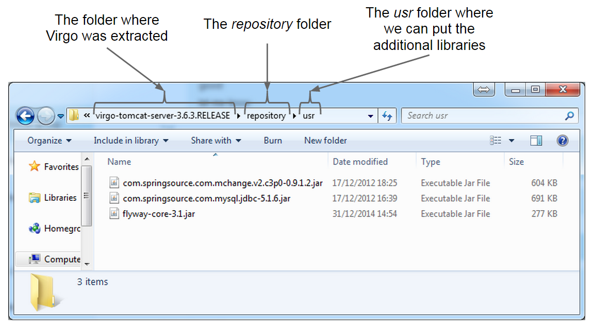

Databases are an important part of most applications irrespective of their size and nature.  Data needs to be persisted and this is usually done through a database.  OSGi ([Homepage](http://www.osgi.org/Main/HomePage)) is an emerging platform providing high degree of modularity and also supports the hot deployment and replacement of modules.  This article describes how to use Flyway ([Homepage](http://flywaydb.org/)), a database migration library, with Eclipse Virgo ([Homepage](http://eclipse.org/virgo/)) OSGi implementation (previously known as Spring Dynamic Modules ([Reference Guide](http://docs.spring.io/osgi/docs/current/reference/html/)).

All code listed below is available at: [https://github.com/javacreed/using-flyway-with-virgo](https://github.com/javacreed/using-flyway-with-virgo).  Most of the examples will not contain the whole code and may omit fragments which are not relevant to the example being discussed. The readers can download or view all code from the above link.

This article is targeted for developers that are already familiar with Maven ([Homepage](http://maven.apache.org/)) and Virgo and will not introduce these two technologies.  It provides a small description of Flyway but the main focus of this article is on the setup of the environment required to run Flyway on Virgo, which is described first.  The article follows by providing a brief description of Flyway and the example used.

## Setup

Most of the articles available in this website do not require any special setup as these describe algorithms or techniques and focus on such things.  These other articles make use of Maven to manage the dependencies and the reader is responsible from making these dependencies available to the _working environment_ (where the examples are executed).  This article too makes use of Maven, but it also includes the working environment.  Before we can start we need to prepare the working environment together with the development environment.

This section assumes that both Maven and Virgo are already installed locally and are accessible to the reader.  The following sub sections will go through the setup required to setup the environment required to successfully run the examples that are available with this article.

## Maven Properties

We need to create a profile and define four properties as shown next.

1. `virgoPort`: The JMX port on which Virgo is listening.
1. `virgoPath`: The local absolute path to Virgo's root installation.
1. `virgoUsername`: The username to be used to deploy module.
1. `virgoPassword`: The password for this username.

Since this is the development environment, we did not change the default port, username and password of Virgo.  A profile was added to the `settings.xml` file ([Tutorial](http://maven.apache.org/examples/injecting-properties-via-settings.html)) as shown next.

```xml
    <profile>
      <id>development-environment</id>
      <properties>
        <virgoPort>9875</virgoPort>
        <virgoPath>C:\\Virgo\\virgo-tomcat-server-3.6.3.RELEASE</virgoPath>
        <virgoUsername>admin</virgoUsername>
        <virgoPassword>springsource</virgoPassword>
      </properties>
    </profile>
```

In our case, Virgo is extracted and installed in the local path: `C:\Virgo\virgo-tomcat-server-3.6.3.RELEASE`.  

This profile is marked always active and added to the list of active profiles in the same  `settings.xml` file as shown next

```xml
  <activeProfiles>
    <activeProfile>development-environment</activeProfile>
  </activeProfiles>
```

These four properties are referred to from the application POM file shown in this article.

### Virgo Dependencies

We need to setup the Virgo OSGi server and include certain libraries (or dependencies).  The following list shows three libraries that need to be downloaded and added to the Virgo repository.

1. Data source library: `com.springsource.com.mchange.v2.c3p0-0.9.1.2.jar`, which can be downloaded from: [here](http://ebr.springsource.com/repository/app/bundle/version/detail?name=com.springsource.com.mchange.v2.c3p0&version=0.9.1.2) or copied from the local Maven repository

1. The database driver library, MySQL ([Homepage](http://www.mysql.com/)) in our case: `com.springsource.com.mysql.jdbc-5.1.6.jar`, which can be downloaded from: [here](http://ebr.springsource.com/repository/app/bundle/version/detail?name=com.springsource.com.mysql.jdbc&version=5.1.6) or copied from the local Maven repository

1. The Flyway library: `flyway-core-3.1.jar`, which can be downloaded from: [here](http://mvnrepository.com/artifact/org.flywaydb/flyway-core/3.1) or copied from the local Maven repository

These three libraries need to be added to Virgo''s repository as shown next.



The above image shows these three libraries under the `repository/usr`, which is one of the default repository location available.  These libraries can be added in any repository.

When this article was being written, the latest version of Flyway, version 3.1, had a small issue which prevented this library to work well with the latest version of Virgo, version 3.6.3.  The manifest file of the Flyway library, version 3.1, did not import the logger package: `org.slf4j` and caused this library to fail with the following error.

```
Caused by: org.eclipse.virgo.kernel.osgi.framework.ExtendedClassNotFoundException: org.slf4j.LoggerFactory in KernelBundleClassLoader: [bundle=org.flywaydb.core_3.1.0]
	at org.eclipse.virgo.kernel.userregion.internal.equinox.KernelBundleClassLoader.loadClass(KernelBundleClassLoader.java:150)
	at java.lang.ClassLoader.loadClass(ClassLoader.java:357)
	... 80 common frames omitted
Caused by: java.lang.ClassNotFoundException: org.slf4j.LoggerFactory
	at org.eclipse.osgi.internal.loader.BundleLoader.findClassInternal(BundleLoader.java:501)
	at org.eclipse.osgi.internal.loader.BundleLoader.findClass(BundleLoader.java:421)
	at org.eclipse.osgi.internal.loader.BundleLoader.findClass(BundleLoader.java:412)
	at org.eclipse.osgi.internal.baseadaptor.DefaultClassLoader.loadClass(DefaultClassLoader.java:107)
	at org.eclipse.virgo.kernel.userregion.internal.equinox.KernelBundleClassLoader.loadClass(KernelBundleClassLoader.java:146)
	... 81 common frames omitted
```

**Note that the above error will only be shown once, when this library is used for the first time.  Then an different error is shown which may mislead you in understanding where the problem is**.

To fix this issue, please modify the manifest and include the following `,org.slf4j;resolution:=optional` under the `Import-Package` section of the manifest as shown next.

```
Manifest-Version: 1.0
Bundle-Description: Flyway: Database Migrations Made Easy.
Bundle-License: https://github.com/flyway/flyway/blob/master/LICENSE.t
 xt
Bundle-SymbolicName: org.flywaydb.core
Archiver-Version: Plexus Archiver
Built-By: Axel
Bnd-LastModified: 1417098600779
Bundle-ManifestVersion: 2
Import-Package: javax.sql,org.apache.commons.logging;version="[1.1,2)"
 ;resolution:=optional,org.osgi.framework;version="1.3.0";resolution:=
 mandatory,org.springframework.jdbc.core;version="[2.5,5.0)";resolutio
 n:=optional,org.springframework.jdbc.datasource;version="[2.5,5.0)";r
 esolution:=optional,org.slf4j;resolution:=optional
Tool: Bnd-1.50.0
Export-Package: org.flywaydb.core;uses:="org.flywaydb.core.api,org.fly
 waydb.core.api.callback,org.flywaydb.core.api.resolver,javax.sql";ver
 sion="3.1",org.flywaydb.core.api;version="3.1",org.flywaydb.core.api.
 callback;uses:="org.flywaydb.core.api";version="3.1",org.flywaydb.cor
 e.api.migration;uses:="org.flywaydb.core.api";version="3.1",org.flywa
 ydb.core.api.resolver;uses:="org.flywaydb.core.api";version="3.1",org
 .flywaydb.core.api.migration.jdbc;version="3.1",org.flywaydb.core.api
 .android;version="3.1",org.flywaydb.core.api.migration.spring;uses:="
 org.springframework.jdbc.core";version="3.1"
Bundle-Name: flyway-core
Bundle-Version: 3.1.0
Created-By: Apache Maven Bundle Plugin
Build-Jdk: 1.8.0_20
```

More information about this issue can be found at: [https://github.com/flyway/flyway/issues/914](https://github.com/flyway/flyway/issues/914).

### Virgo Logs

We can modify the logs such that any logs written by our code is logged in a separate file.  This modification is optional and has no effect on our example.  The example will work irrespective of this modification.

We added a new appender in the `configuration/serviceability.xml` file with the name of `JAVACREED_LOG_FILE`, shown next.

```xml
	<appender name="JAVACREED_LOG_FILE" class="ch.qos.logback.core.rolling.RollingFileAppender">
		<file>serviceability/javacreed/log.log</file>
		<rollingPolicy class="ch.qos.logback.core.rolling.FixedWindowRollingPolicy">
			<FileNamePattern>serviceability/javacreed/log_%i.log</FileNamePattern>
			<MinIndex>1</MinIndex>
			<MaxIndex>10</MaxIndex>
		</rollingPolicy>
		<triggeringPolicy class="ch.qos.logback.core.rolling.SizeBasedTriggeringPolicy">
			<MaxFileSize>10MB</MaxFileSize>
		</triggeringPolicy>
		<encoder class="ch.qos.logback.classic.encoder.PatternLayoutEncoder">
			<Pattern>[%d{yyyy-MM-dd HH:mm:ss.SSS}] %-5level %-28.28thread %-64.64logger{64} %X{medic.eventCode} %msg %ex%n</Pattern>
		</encoder>
	</appender>
```

Then added a new logger in the same file.

```xml
	<logger level="DEBUG" additivity="false" name="com.javacreed">
		<appender-ref ref="JAVACREED_LOG_FILE" />
	</logger>
```

Any logs produced by classes within the `com.javacreed` package will go to the new log file.  This can be very useful especially when trying to debug something through the logs as this log file will only include logs from our code.

### Virgo Maven Plugin

The application used as an example with this article makes use of plugin named `virgo-maven-plugin` ([Git](https://github.com/frieder/virgo-maven-plugin)).  This plugin allows us to deploy modules to Virgo using Maven.  We did a small modification to this plugin as well.  This plugin is not able to deploy modules which path contains spaces.  Many wise developers avoid spaces in their paths as this tend to cause problems here and there.  Since I am not that wise, my path contained spaces and thus this plugin failed.  We modified the `Deploy` class and replaced all spaces in the path with `%20` as highlighted in the following example.

```java
package net.flybyte.virgo.maven.deployer;

import java.io.IOException;

import javax.management.MBeanServerConnection;
import javax.management.ObjectName;

import net.flybyte.virgo.maven.BaseMojo;

import org.apache.maven.plugin.MojoExecutionException;
import org.apache.maven.plugin.MojoFailureException;

/**
 * Deploys a maven artefact (bundle) at runtime to Eclipse Virgo via the deployer MBean. Check the <a href=
 * "http://virgo-opengrok.springsource.org/xref/virgo/org.eclipse.virgo.kernel/org.eclipse.virgo.kernel.deployer/src/main/java/org/eclipse/virgo/kernel/deployer/Deployer.java"
 * >Virgo sourcecode</a> for more information.
 *
 * @goal deploy
 * @requiresProject true
 *
 * @author Frieder Heugel
 */
public class Deploy extends BaseMojo {

  @Override
  public void execute() throws MojoExecutionException, MojoFailureException {
    try {
      logger.info("Start deploying the artefact to Eclipse Virgo");
      final MBeanServerConnection connection = getConnection();
      // get the Deployer MBean and set up the arguments
      String artefactPath = getArtefactFile().getAbsolutePath().replaceAll("\\\\", "/");
      logger.info("Add " + artefactPath + " to the argument list");

      // Replace the spaces with %20
      artefactPath = artefactPath.replace(" ", "%20");

      final ObjectName name = new ObjectName(BaseMojo.MBEAN_DEPLOYER);
      final Object[] params = { "file:///" + artefactPath, isRecoverable() };
      final String[] signature = { "java.lang.String", "boolean" };
      logger.info("Deploy artifact");
      // invoke the deploy method of the Deployer MBean
      connection.invoke(name, "deploy", params, signature);
    } catch (final Exception e) {
      throw new MojoFailureException(BaseMojo.stackTrace2String(e));
    } finally {
      try {
        closeConnector();
      } catch (final IOException e) {
        throw new MojoFailureException(BaseMojo.stackTrace2String(e));
      }
    }
  }
}
```

In order not to mix things we changed the project version within the POM file to `1.0.2-SNAPSHOT` as shown next.

```xml
<project xmlns="http://maven.apache.org/POM/4.0.0" xmlns:xsi="http://www.w3.org/2001/XMLSchema-instance"
	xsi:schemaLocation="http://maven.apache.org/POM/4.0.0 http://maven.apache.org/maven-v4_0_0.xsd">
	<modelVersion>4.0.0</modelVersion>
	<groupId>net.flybyte.virgo</groupId>
	<artifactId>virgo-maven-plugin</artifactId>
	<version>1.0.2-SNAPSHOT</version>
	<packaging>maven-plugin</packaging>
	<name>Maven plugin for Eclipse Virgo</name>
```

Then installed this new plugin to our local Maven repository so that it is available to the application showcased in this article.

This section concluded all setup required to be able to use the example shown here.  Most of these changes are required by anyone who would like to use Flyway with Virgo.

## Flyway

Flyway is a library that can be used to migrate the database from one version to the next keeping all environments in synch without having to rely on any manual intervention.  Flyway creates a metadata table called  `schema_version`, where it keeps record of the current state of the database.  Any new changes are automatically executed when Flyway runs and thus the database is kept up-to-date automatically.  For more information about Flyway please refer to this [video tutorial](https://www.youtube.com/watch?v=0oVM79TS6R8&list=PLP7XIoztemXR1tzfnJSr9Z0odnBAHQ9DB) (Part 4 in another tutorial titled [Simple Java Database Swing Application](http://www.javacreed.com/simple-java-database-swing-application/)).

One of the simplest ways to migrate the database is through SQL scripts.   In our example we used three scripts, listed below:

1. `V1__Create_sample_table.sql`
1. `V1_1__Alter_sample_table.sql`
1. `V2__Add_sample_data.sql`

The script names are prefixed with the version number followed by two underscores.  This provides means for Flyway to execute the scripts in the defined order.  When a new change is required, a new script is added and then Flyway will take care of the rest.  For example we can add a new script named `V3__Some_more_changes.sql`, which script is executed by Flyway next time it runs.

In this section we described Flyway very briefly.  In the next section we will see how to use Flyway within an OSGi module.

## Running Flyway within Virgo

An OSGi module starts with a `BundleActivator` ([Java Doc](http://www.osgi.org/javadoc/r4v43/core/org/osgi/framework/BundleActivator.html)).  A `BundleActivator` is the entry point of an OSGi module.  This can be seen as the class with the `main()` method in a traditional Java application.  We will setup Flyway in our `BundleActivator` as shown in the following example.

```java
package com.javacreed.examples.flyway.virgo.internal;

import org.flywaydb.core.Flyway;
import org.osgi.framework.BundleActivator;
import org.osgi.framework.BundleContext;
import org.slf4j.Logger;
import org.slf4j.LoggerFactory;

import com.mchange.v2.c3p0.ComboPooledDataSource;

public class ExampleActivator implements BundleActivator {

  private static final Logger LOGGER = LoggerFactory.getLogger(ExampleActivator.class);

  private final ComboPooledDataSource dataSource = new ComboPooledDataSource();

  @Override
  public void start(final BundleContext context) throws Exception {
    try {
      ExampleActivator.LOGGER.debug("Starting");

      ExampleActivator.LOGGER.debug("Initialising the data source");
      dataSource.setUser("root");
      dataSource.setPassword("root");
      dataSource.setMaxPoolSize(2);
      dataSource.setDriverClass("com.mysql.jdbc.Driver");
      dataSource.setJdbcUrl("jdbc:mysql://localhost:3306/dev_flyway");

      ExampleActivator.LOGGER.debug("Initialising Flyway");
      final Flyway flyway = new Flyway();
      flyway.setDataSource(dataSource);

      ExampleActivator.LOGGER.debug("Starting migration");
      flyway.migrate();
      ExampleActivator.LOGGER.debug("Migration Complete");
    } catch (final Throwable e) {
      ExampleActivator.LOGGER.error("Failed to migrate the database", e);
    }
  }

  @Override
  public void stop(final BundleContext context) throws Exception {
    ExampleActivator.LOGGER.debug("Stopping");
    ExampleActivator.LOGGER.debug("Closing the data source");
    dataSource.close();
    ExampleActivator.LOGGER.debug("Done");
  }
}
```

Let us break this class in to small pieces and describe each piece individually.

1. The `ExampleActivator` comprise two methods and two fields as shown next.

    ```java
    public class ExampleActivator implements BundleActivator {

      private static final Logger LOGGER = LoggerFactory.getLogger(ExampleActivator.class);

      private final ComboPooledDataSource dataSource = new ComboPooledDataSource();

      @Override
      public void start(final BundleContext context) throws Exception {
        /* Method body removed for brevity */
      }

      @Override
      public void stop(final BundleContext context) throws Exception {
        /* Method body removed for brevity */
      }
    }
    ```

    The `start()` method is executed when the module starts.  This is very similar to the `main()` in a traditional Java application.  When the module is stopped, or undeployed, `stop()` method is executed.  These two methods are a perfect fit for any initialisation or disposal functionality.

1. The `start()` method starts by initialising the data source, creates an instance of `Flyway` ([Java Doc](http://flywaydb.org/documentation/api/javadoc.html)) and the migrates the database.

    ```java
      @Override
      public void start(final BundleContext context) throws Exception {
        try {
          ExampleActivator.LOGGER.debug("Starting");

          ExampleActivator.LOGGER.debug("Initialising the data source");
          dataSource.setUser("root");
          dataSource.setPassword("root");
          dataSource.setMaxPoolSize(2);
          dataSource.setDriverClass("com.mysql.jdbc.Driver");
          dataSource.setJdbcUrl("jdbc:mysql://localhost:3306/dev_flyway");

          ExampleActivator.LOGGER.debug("Initialising Flyway");
          final Flyway flyway = new Flyway();
          flyway.setDataSource(dataSource);

          ExampleActivator.LOGGER.debug("Starting migration");
          flyway.migrate();
          ExampleActivator.LOGGER.debug("Migration Complete");
        } catch (final Throwable e) {
          ExampleActivator.LOGGER.error("Failed to migrate the database", e);
        }
      }
    ```

    The data source is initialised with hard coded values.  Ideally such values are loaded from properties or configurations file, but for simplicity we simply hard coded these values.  The database named `dev_flyway` was created before and `Flyway` is not responsible from creating the database.

    ```java
          ExampleActivator.LOGGER.debug("Initialising the data source");
          dataSource.setUser("root");
          dataSource.setPassword("root");
          dataSource.setMaxPoolSize(2);
          dataSource.setDriverClass("com.mysql.jdbc.Driver");
          dataSource.setJdbcUrl("jdbc:mysql://localhost:3306/dev_flyway");
    ```

    Next we create and instance of `Flyway` using the just configured data source.

    ```java
          ExampleActivator.LOGGER.debug("Initialising Flyway");
          final Flyway flyway = new Flyway();
          flyway.setDataSource(dataSource);
    ```

    Finally we invoke the `migrate()` method to start the database migration process.

    ```java
          ExampleActivator.LOGGER.debug("Starting migration");
          flyway.migrate();
    ```

    As we saw, Flyway is quite straightforward to use. Provide it with a datasource and simple call the `migrate()` method.

1. Before our module is stopped, or undeployed, we close the data source and any active database connection.

    ```java
      @Override
      public void stop(final BundleContext context) throws Exception {
        ExampleActivator.LOGGER.debug("Stopping");
        ExampleActivator.LOGGER.debug("Closing the data source");
        dataSource.close();
        ExampleActivator.LOGGER.debug("Done");
      }
    ```

When deployed, Flyway will execute any pending scripts and update the database.

## Conclusion

Databases are an important part of most applications irrespective of their size and nature and keeping these in synch across different environments can be hectic.  OSGi is an emerging technology which enabled modularity.  This technology handles classpaths differently than a traditional application and can have an undesired effect on our application.  As we saw, a missing entry in the manifest may cause the application to fail.  This article provided all required steps to configure Flyway to work properly on Virgo.  Some of the things discussed here may become obsolete with newer versions of both Virgo and Flyway.
